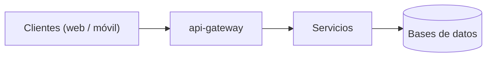

# Arquitectura

<!-- Completar: diagrama de alto nivel. El mapa de dependencias entre repos ya
     está en el mapa de servicios (generado); acá va lo que no sale de las
     fichas: clientes, entrada pública, colas, bases, terceros. -->

## Flujo de una request

<!-- Completar: autenticación, ruteo, llamadas entre servicios. -->

## Decisiones relacionadas

Ver el [índice de ADRs](../_generado/adr.md).
